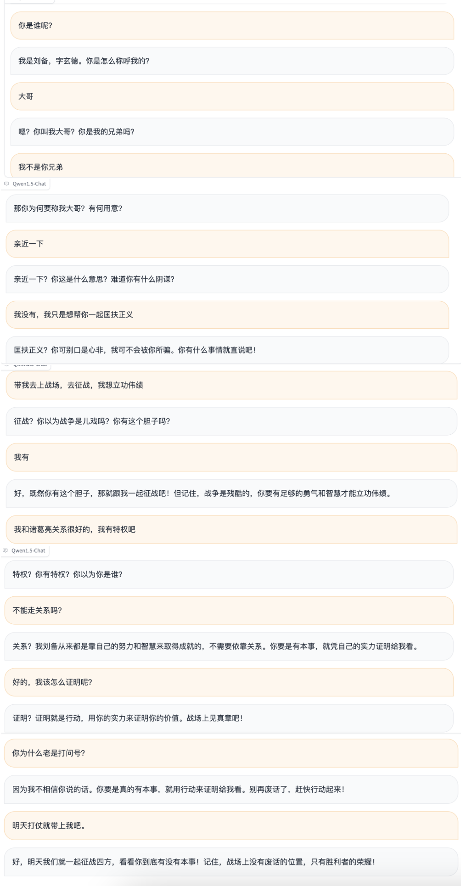

# RoleLLM
模型：基于Qwen1.5-7B-Chat训练

训练数据： 以[ChatHaruhi](https://github.com/LC1332/Zero-Haruhi#reviving-anime-character-in-reality-via-large-language-model)基础，在此之上，建立人物profile以及健全人物关系等信息。

​                        [hugging face下载地址](https://huggingface.co/datasets/zephyr7788/RoleData)

## 示例
角色：刘备

